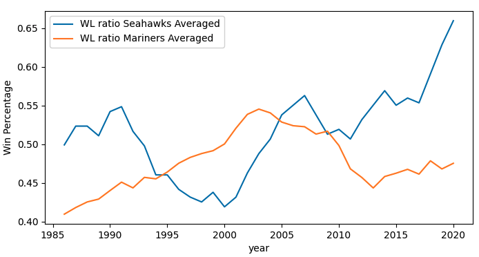
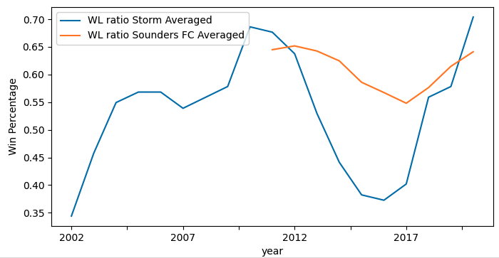

# Seattle Sports

## Datasets

Seattle, Washington sport data scraped from Wikipedia

## Github repo

<https://github.com/DanWang1230/Seattle_sports>

## Research questions

* How have the win percentages for Seahawks and Mariners changed over the last forty years?

* How have the win percentages for Sounders FC changed over the last ten years?

* How have the win percentages for Storm changed over the last twenty years?

## Methods

* This project was concerned with answering the question of how the win percentages of the four major Seattle sports teams (Seahawks, Mariners, Sounders FC, and Storm) have changed.
* Wikipedia was scraped for data concerning wins and losses by season for each team. 

* Data cleaning has been conducted.

* A 10-year moving average for Seahawks and Mariners was plotted to help the reader identify any major trends in the team’s win percentages. And a 3-year moving average is chosen for the two younger teams Sounders FC and Storm.

## Results and Conclusions

* The plot indicates the years of high win percentage for Seahawks are around 1990 and 2007, with periods of decline following both high points.

* The Mariner’s win percentage shows a continuing increase up to 2003 and stays high from 2003 to 2010.

* The Storm's win percentage reaches a peak at 2010 and keeps increasing in recent years.

* The plot shows that the win percentage of Sounder FC is relative stable and stays in between 0.554 to 0.657.
