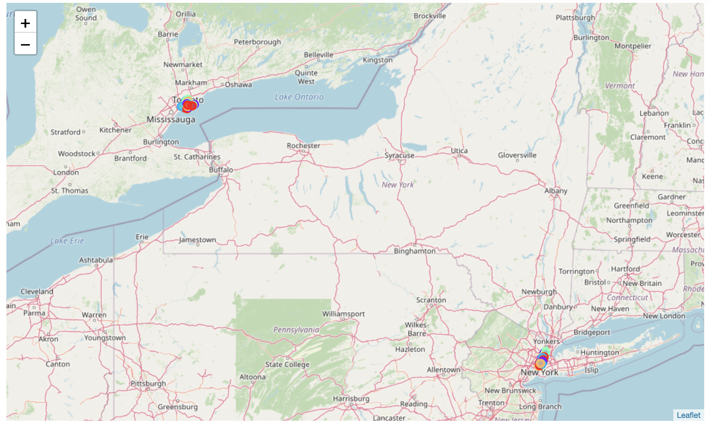
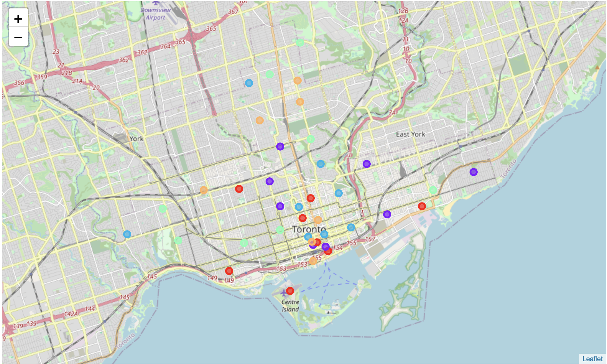
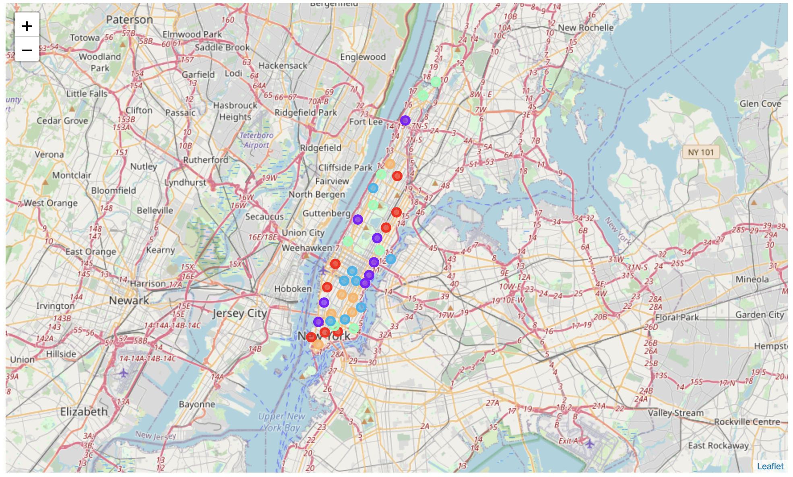
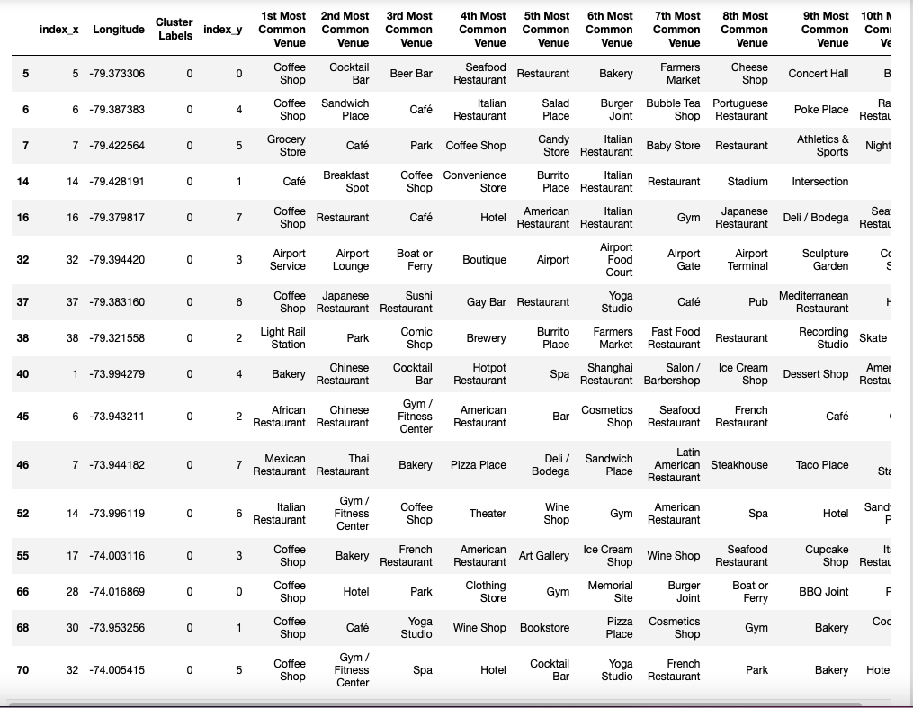

[comment]:<Created by Dan Wang (daw1230@uw.edu) at 2-8-2020>
# Comparing Two Cities by Venue Features

# Introduction: Business Problem

In the project, we will try to cluster similar neighborhoods in two cities Toronto and New York City. Specifically, this report will be targeted to stakeholders interested in deploying business correspondingly in the two cities.

We will use our data science powers to consider various venue features when implementing the clustering algorithm.

# Data

Based on our definition of the problems, the following data resources will be needed:

- NYC boroughs, neighborhoods, and venue information obtained from Foursquare.

- Toronto boroughs, neighborhoods, and venue information obtained from Foursquare.

- Especially, we focus on the Manhattan Borough of New York City.

# Methodology

## Data analysis

After getting loaded, the datasets for the NYC and Toronto are processed individually first and then merged to fit into the K-means clustering in the next section. The procedures go as follows:
1. Load dataset
2. Transform dataset to Pandas dataframe (if necessary)
3. Examine the dataframe using , `df.shape`, `df.head()`, or `df.tail()` every now and then

```
toronto_data = df_new[df_new['Borough'].str.contains('Toronto')].reset_index(drop=True)

toronto_data.head()
```


4. Use `geopy` library to get the latitude and longitude values


5. Create maps of cities or boroughs with neighborhoods superimposed on top
6. Use the `Foursquare API` to explore the neighborhoods and get venues


7. Merge the two dataframes

```
merge_grouped = toronto_grouped.append(manhattan_grouped).fillna(0).reset_index()
```

## K-means clustering

In this section, I implement k-means to cluster the neighborhoods into 5 clusters. First, I create a new dataframe that includes the cluster as well as the top 10 venues for each neighborhood. Then I visualize the resulting clusters.

# Results 

A pipeline is built to compare two cities or boroughs based on the features of their neighborhoods. Neighborhoods with similar venue features are clustered into the same category.

Both Toronto and Manhattan


Zoom-in view of Toronto


Zoom-in view of Manhattan


# Discussion

Based on the cluster results, we can furthermore compare different categories and get important information for business development and city planning. We can examine each cluster and determine the discriminating venue categories that distinguish each cluster. Based on the defining categories, we can then assign a name to each cluster. The neighborhoods in cluster 0 are shown in the following figure.

Cluster 0


# Conclusion
In conclusion, I successfully implemented a pipeline to compare two cities or boroughs based on the features of their neighborhoods. Neighborhoods with similar venue features are clustered into the same category.
