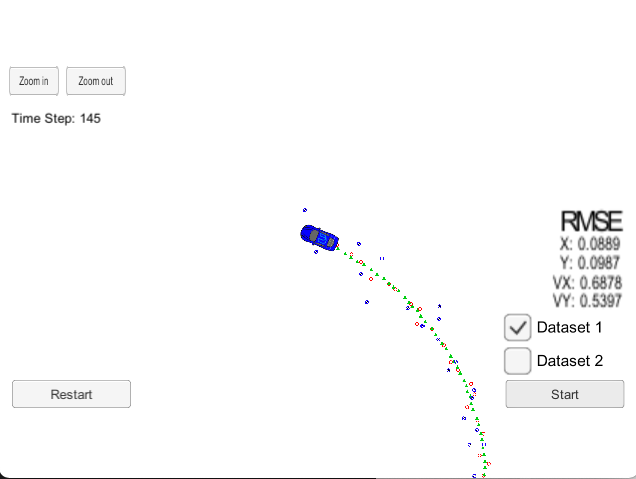
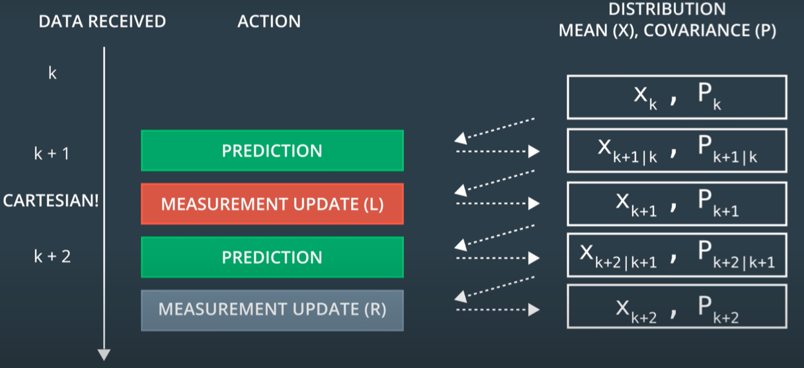

# Extended Kalman Filter and Sensor Fusion in Perception

## Goals

The goal of this project is to utilize the Kalman filter and extended Kalman filter (EKF) to estimate the state of a bicycle moving around the car. To achieve this purpose, a general sensor fusion techinique is used to combine noisy lidar and radar measurements.

The GitHub repo of this project can be found [here](https://github.com/DanWang1230/Extended_Kalman_Filter).

## Results

In the following image, lidar measurements are red circles, and radar measurements are blue circles with an arrow pointing in the direction of the observed angle. The green triangles are estimations given by the Kalman filter and extended Kalman filters. 

We can clearly see that the radar measurements have poorer resolution compared with the lidar measurements. The blue car-shaped object is a little misleading here and actually represents the bicycle that moves around the car.

A linear motion model is used for the bicycle. Thus, the prediction step is linear for both the Kalman filter and the EKF. However, the measurement update step is different for the two filters. The lidar measurement model is linear and applies the standard Kalman filter, while the radar measurement is nonlinear and applies the EKF. The two kinds of measurement update are fused smoothly based on the timestamps, as shown below.

[The video here](https://youtu.be/E2RPJFtib5Q) clearly shows that the filters (see the green markers) successfully detects the location of the moving bicycle.

